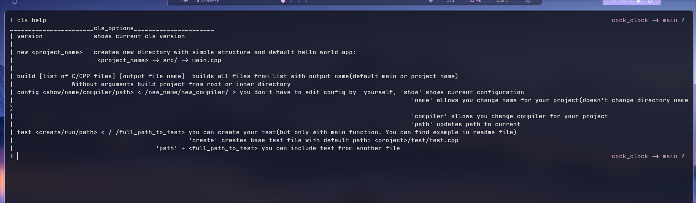
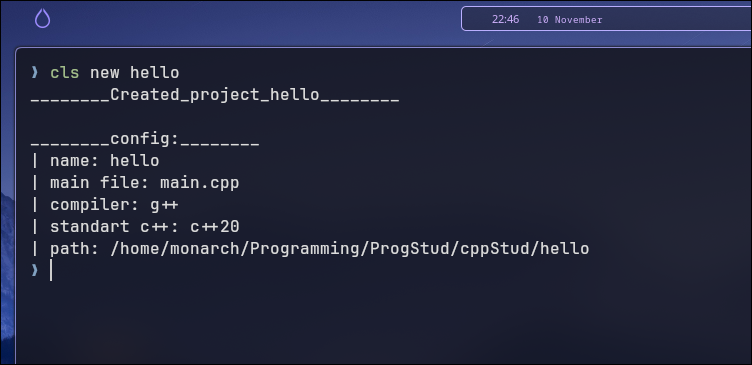
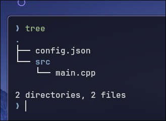
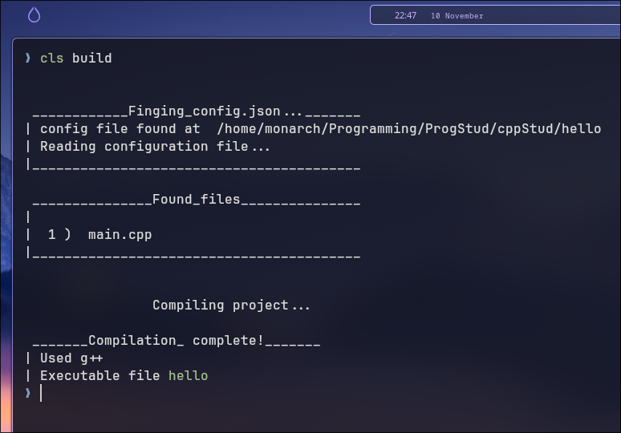

# CLS(C Language Support)
Current verion v0.002

This is a little cli application for make c/c++ experience more comfortable.
This application i made mostly for myself and for few of my friends. So don't expect much

## Installation
I didn't use any librares so you just need to install golang
Debian/Ubuntu
```bash
sudo apt install golang
```
Fedora
```bash
sudo dnf install golang
```
Arch
```bash
sudo pacman -S go
```

And then you could
```bash
git clone https://github.com/Fufik-pivufik/C-language-support
cd C-languange-support
./install
```
And then check 
```bash
cls version
```

# Using
When you did all previous steps you can use *cls*

```bash
cls help # command for view all options
```



```bash
cls new <project_name> # this commad creates a simple hello world app with basic structure
```




```bash
cls build # this command builds all your cpp files in src 
```



```bash
cls config <show/<field name>> [changed feild containment] # shows current configuration or changes picked field's containment
```


